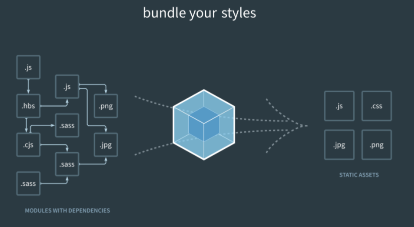

# webpack5-book

这个仓库主要记录学习`webpack`的过程。

学习的`webpack`的版本为5.72.1，`webpack-cli`的版本为4.9.2。

## webpack简介

本质上，`webpack` 是一个现代 `JavaScript` 应用程序的静态模块打包器(`module bundler`)。当 `webpack` 处理应用程序时，它会递归地构建一个依赖关系图(`dependency graph`)，其中包含应用程序需要的每个模块，然后将所有这些模块打包成一个或多个 `bundle`。




## webpack安装

在安装 `Webpack` 前，确保你的本地环境支持 `node.js`。

```bash
npm install webpack -g
```

或者直接安装在项目.

```bash
npm install webpack webpack-cli -D
```

`webpack-cli`是为了更合适且方便地使用配置，通过在目录中的`webpack.config.js`对`webpack`进行配置。`cli`中传入的任何参数会在配置文件中映射为对应的参数。

## webpack初体验

我们写一个最简单的例子。

```js
// index.js
console.log("hi webpack");
```

输入命令：

```bash
npx webpack ./index.js --mode development
```

随后我们可以看到目录中创建了一个 `dist`文件夹，里边的文件就是经过打包后生成的。

### 体验配置文件

在根目录下新建一个`webpack.config.js`文件，用于`webpack`的配置。
```js
// webpack.config.js
const path = require("path");
module.exports = {
  mode: "development",
  entry: "./index.js",
  output: {
    path: path.resolve(__dirname, "dist"),
    filename: "bundle.js",
    clean: true
  },
};
```

输入命令：

```bash
npx webpack
```

后续的例子都是通过文件进行配置，同时会讲解`webpack.config.js`中各字段的使用及用途。


## webpack核心概念

### 入口 `entry`


入口起点(`entry point`)指示 `webpack` 应该使用哪个模块，来作为构建其内部依赖图的开始。进入入口起点后，`webpack` 会找出有哪些模块和库是入口起点（直接和间接）依赖的。

默认值是 `./src/index.js`，但你可以通过在 `webpack configuration` 中配置 `entry` 属性，来指定一个（或多个）不同的入口起点。

```js
module.exports = {
  entry: './src/index.js'
};
```

`entry`值的类型可以是`string`、`object`或者`array`。

```js
module.exports = {
  mode: "development",
  entry: './src/index.js'，
  entry: ['./src/index.js', './src/main.js'],
  entry: {
    page1: './src/index.js',
    page2: './src/main.js'
  }
};
```

#### 单入口配置
当设置成`array`类型的时候，代表将多个文件打包为一个文件。

在[`demo`](demo/webpack核心概念/entry/single/dist/main.js)中可以看到`index.js`和`main.js`都被打包在一个文件中。

如果要配置单个入口文件，可以给 `entry` 指定一个 `string` 或者 `array` 类型的值，这样就只会生成一个 `chunk`，当没有配置入口的文件对象名称时，默认使用 `main`。

#### 多入口配置

当设置`object`类型时，则可以配置多个入口。对象中的每一对属性对，都代表着一个入口文件。通常用于多页面配置。

`entry: {[entryChunkName: string]: string|Array<string>}`

当没有配置`output`时，`entryChunkName`这个`key`就表示打包后生成文件的文件名。

比如[`demo`](demo/webpack核心概念/entry/multi/dist)中生成两个文件。

#### 动态entry配置

假如项目里有多个页面需要为每个页面的入口配置一个 `Entry` ，但这些页面的数量可能会不断增长，则这时 `Entry` 的配置会受到到其他因素的影响导致不能写成静态的值。其解决方法是把 `Entry` 设置成一个函数去动态返回上面所说的配置.

```js
module.exports = {
  // 同步
  // entry: () => {
  //   return '../src/index.js'
  // }
  // entry: () => {
  //   return ['../src/index.js', '../src/main.js']
  // }
  // entry: () => {
  //   return {
  //     page1: '../src/index.js',
  //     page2: '../src/main.js'
  //   }
  // }

  // 异步
  entry: () => {
    return new Promise((resolve) => {
      resolve({
        page1: '../src/index.js',
        page2: '../src/main.js'
      })
    })
  }
};
```

### 输出 `output`

如果没有指定`output`，那么打包后的文件默认放在`dist`目录下，单文件的名称为`main.js`，多文件则根据对应`key`进行生成。

配置 `output` 选项可以控制 `webpack` 如何向硬盘写入编译文件。**注意，即使可以存在多个入口起点，但只指定一个输出配置**。

`output`是一个对象，常用属性包括：
- `filename`: 用于输出文件的文件名
- `path`: 输出目录的绝对路径，通常结合`path`一起使用。
- `clean`: 是否清除上一次的打包生成的目录

```js
const path = require("path");
module.exports = {
  output: {
    path: path.resolve(__dirname, "dist"),
    filename: "bundle.js",
    clean: true
  },
};
```

#### 多个入口文件

对于多个入口文件，就不能简单设置`filename`，这样会报错。应该通过使用占位符来确保每个文件具有唯一的名称。

```js
const path = require("path");
module.exports = {
  output: {
    path: path.resolve(__dirname, "dist"),
    filename: '[name].js',
    clean: true
  },
};
```

`[name]`代表用内置的 `name` 变量（之前`entry`中给各个入口文件配置的`entryChunkName`）去替换 `[name]` ，这时你可以把它看作一个字符串模块函数， 每个要输出的 `Chunk` 都会通过这个函数去拼接出输出的文件名称。

除了`name`，还可以使用以下几个：

|   变量名   |        含义        |
|     --     |         --        |
|  [hash]    |模块标识符(module identifier)的 hash|
|[chunkhash] | chunk 内容的 hash  |
|  [name]    |     模块名称       |
|   [id]     | 模块标识符(module identifier) |
|  [query]   | 模块的 query，例如，文件名 ? 后面的字符串 |


### loader

`loader` 用于对模块的源代码进行转换。`loader` 可以使你在 `import` 或"加载"模块时预处理文件。因此，`loader` 类似于其他构建工具中“任务(`task`)”，并提供了处理前端构建步骤的强大方法。`loader` 可以将文件从不同的语言（如 `TypeScript`）转换为 `JavaScript`，或将内联图像转换为 `data URL`。`loader` 甚至允许你直接在 `JavaScript` 模块中 `import` `CSS`文件！

#### 使用loader

在你的应用程序中，有两种使用 `loader` 的方式：

- 配置（推荐）：在 `webpack.config.js` 文件中指定 `loader`。
- 内联：在每个 `import` 语句中显式指定 `loader`。

1. 配置方式

`module.rules` 允许在 `webpack` 配置中指定多个 `loader`。
`loader` 从右到左（或从下到上）地取值(`evaluate`)/执行(`execute`)。

```js
module.exports = {
  module: {
    rules: [
      { test: /\.txt$/, use: 'raw-loader' },
      {
        test: /\.css$/,
        // 从右至左
        // use: ["style-loader", "css-loader"],

        // 从下到上
        use: [
          { loader: "style-loader" },
          {
            loader: "css-loader",
            options: {
              modules: true,
            },
          },
        ],
      },
    ]
  }
};
```
`test`字段用于标识出应该被对应的 `loader` 进行转换的某个或某些文件。

`use`字段表示进行转换时，应该使用哪个 `loader`（当然这些`loader`也需要安装在项目中）。

> 请记住，使用正则表达式匹配文件时，你不要为它添加引号。也就是说，`/\.txt$/` 与 `'/\.txt$/'` 或 `"/\.txt$/"` 不一样。前者指示 `webpack` 匹配任何以 `.txt` 结尾的文件，后者指示 `webpack` 匹配具有绝对路径 `'.txt'` 的单个文件; 这可能不符合你的意图。


2. 内联方法

在每个`import`中显示指定。
```js
import 'raw-loader!./index.txt';
```

对于使用多个`loader`，使用 `!` 将资源中的 `loader` 分开。分开的每个部分都相对于当前目录解析。

```js
import "!style-loader!css-loader!./index.css"
```


### plugins

`loader` 被用于转换某些类型的模块，而插件则可以用于执行范围更广的任务。插件的范围包括，从打包优化和压缩，一直到重新定义环境中的变量。插件接口功能极其强大，可以用来处理各种各样的任务。

想要使用一个插件，你只需要 `require()` 它，然后把它添加到 `plugins` 数组中。多数插件可以通过选项(`option`)自定义。你也可以在一个配置文件中因为不同目的而多次使用同一个插件，这时需要通过使用 `new` 操作符来创建它的一个实例。

跟`loader`一样，在使用前也需要将对应的插件安装在项目中.

我们来举一个常用的插件为例子。

安装
```bash
npm i html-webpack-plugin -D
```

```js
const HtmlWebpackPlugin = require("html-webpack-plugin");

module.exports = {
  entry: "./src/index.js",
  plugins: [new HtmlWebpackPlugin({ title: "use plugin" })],
};
```

在`webpack.config.js`文件中先引入对应的插件，在`plugins`字段中传入对应插件的实例。`html-webpack-plugin`这个插件可以自动生成`html`文件，并把打包后的文件自动引入其中。