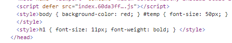

# webpack5-book

这个仓库主要记录学习`webpack`的过程。

学习的`webpack`的版本为5.72.1，`webpack-cli`的版本为4.9.2。

## webpack简介

本质上，`webpack` 是一个现代 `JavaScript` 应用程序的静态模块打包器(`module bundler`)。当 `webpack` 处理应用程序时，它会递归地构建一个依赖关系图(`dependency graph`)，其中包含应用程序需要的每个模块，然后将所有这些模块打包成一个或多个 `bundle`。


## webpack安装

在安装 `webpack` 前，确保你的本地环境支持 `node.js`。

```bash
npm install webpack -g
```

或者直接安装在项目.

```bash
npm install webpack webpack-cli -D
```

`webpack-cli`是为了更合适且方便地使用配置，通过在目录中的`webpack.config.js`对`webpack`进行配置。`cli`中传入的任何参数会在配置文件中映射为对应的参数。

## webpack初体验

我们写一个最简单的例子。

```js
// index.js
console.log("hi webpack");
```

输入命令：

```bash
npx webpack ./index.js --mode development
```

随后我们可以看到目录中创建了一个 `dist`文件夹，里边的文件就是经过打包后生成的。

### 体验配置文件

在根目录下新建一个`webpack.config.js`文件，用于`webpack`的配置。
```js
// webpack.config.js
const path = require("path");
module.exports = {
  mode: "development",
  entry: "./index.js",
  output: {
    path: path.resolve(__dirname, "dist"),
    filename: "bundle.js",
    clean: true
  },
};
```

输入命令：

```bash
npx webpack
```

后续的例子都是通过文件进行配置，同时会讲解`webpack.config.js`中各字段的使用及用途。


## webpack核心概念

### 入口 `entry`


入口起点(`entry point`)指示 `webpack` 应该使用哪个模块，来作为构建其内部依赖图的开始。进入入口起点后，`webpack` 会找出有哪些模块和库是入口起点（直接和间接）依赖的。

默认值是 `./src/index.js`，但你可以通过在 `webpack configuration` 中配置 `entry` 属性，来指定一个（或多个）不同的入口起点。

```js
module.exports = {
  entry: './src/index.js'
};
```

`entry`值的类型可以是`string`、`object`或者`array`。

```js
module.exports = {
  mode: "development",
  entry: './src/index.js'，
  entry: ['./src/index.js', './src/main.js'],
  entry: {
    page1: './src/index.js',
    page2: './src/main.js'
  }
};
```

#### 单入口配置
当设置成`array`类型的时候，代表将多个文件打包为一个文件。

在[`demo`](demo/webpack核心概念/entry/single/dist/main.js)中可以看到`index.js`和`main.js`都被打包在一个文件中。

如果要配置单个入口文件，可以给 `entry` 指定一个 `string` 或者 `array` 类型的值，这样就只会生成一个 `chunk`，当没有配置入口的文件对象名称时，默认使用 `main`。

#### 多入口配置

当设置`object`类型时，则可以配置多个入口。对象中的每一对属性对，都代表着一个入口文件。通常用于多页面配置。

`entry: {[entryChunkName: string]: string|Array<string>}`

当没有配置`output`时，`entryChunkName`这个`key`就表示打包后生成文件的文件名。

比如[`demo`](demo/webpack核心概念/entry/multi/dist)中生成两个文件。

#### 动态entry配置

假如项目里有多个页面需要为每个页面的入口配置一个 `Entry` ，但这些页面的数量可能会不断增长，则这时 `Entry` 的配置会受到到其他因素的影响导致不能写成静态的值。其解决方法是把 `Entry` 设置成一个函数去动态返回上面所说的配置.

```js
module.exports = {
  // 同步
  // entry: () => {
  //   return '../src/index.js'
  // }
  // entry: () => {
  //   return ['../src/index.js', '../src/main.js']
  // }
  // entry: () => {
  //   return {
  //     page1: '../src/index.js',
  //     page2: '../src/main.js'
  //   }
  // }

  // 异步
  entry: () => {
    return new Promise((resolve) => {
      resolve({
        page1: '../src/index.js',
        page2: '../src/main.js'
      })
    })
  }
};
```

### 输出 `output`

如果没有指定`output`，那么打包后的文件默认放在`dist`目录下，单文件的名称为`main.js`，多文件则根据对应`key`进行生成。

配置 `output` 选项可以控制 `webpack` 如何向硬盘写入编译文件。**注意，即使可以存在多个入口起点，但只指定一个输出配置**。

`output`是一个对象，常用属性包括：
- `filename`: 用于输出文件的文件名
- `path`: 输出目录的绝对路径，通常结合`path`一起使用。
- `clean`: 是否清除上一次的打包生成的目录

```js
const path = require("path");
module.exports = {
  output: {
    path: path.resolve(__dirname, "dist"),
    filename: "bundle.js",
    clean: true
  },
};
```

#### 多个入口文件

对于多个入口文件，就不能简单设置`filename`，这样会报错。应该通过使用占位符来确保每个文件具有唯一的名称。

```js
const path = require("path");
module.exports = {
  output: {
    path: path.resolve(__dirname, "dist"),
    filename: '[name].js',
    clean: true
  },
};
```

`[name]`代表用内置的 `name` 变量（之前`entry`中给各个入口文件配置的`entryChunkName`）去替换 `[name]` ，这时你可以把它看作一个字符串模块函数， 每个要输出的 `Chunk` 都会通过这个函数去拼接出输出的文件名称。

除了`name`，还可以使用以下几个：

|   变量名   |        含义        |
|     --     |         --        |
|  [hash]    |模块标识符(module identifier)的 hash|
|[chunkhash] | chunk 内容的 hash  |
|  [name]    |     模块名称       |
|   [id]     | 模块标识符(module identifier) |
|  [query]   | 模块的 query，例如，文件名 ? 后面的字符串 |


### `loader`

`loader` 用于对模块的源代码进行转换。`loader` 可以使你在 `import` 或"加载"模块时预处理文件。因此，`loader` 类似于其他构建工具中“任务(`task`)”，并提供了处理前端构建步骤的强大方法。`loader` 可以将文件从不同的语言（如 `TypeScript`）转换为 `JavaScript`，或将内联图像转换为 `data URL`。`loader` 甚至允许你直接在 `JavaScript` 模块中 `import` `CSS`文件！

#### 使用loader

在你的应用程序中，有两种使用 `loader` 的方式：

- 配置（推荐）：在 `webpack.config.js` 文件中指定 `loader`。
- 内联：在每个 `import` 语句中显式指定 `loader`。

1. 配置方式

`module.rules` 允许在 `webpack` 配置中指定多个 `loader`。
`loader` 从右到左（或从下到上）地取值(`evaluate`)/执行(`execute`)。

```js
module.exports = {
  module: {
    rules: [
      { test: /\.txt$/, use: 'raw-loader' },
      {
        test: /\.css$/,
        // 从右至左
        // use: ["style-loader", "css-loader"],

        // 从下到上
        use: [
          { loader: "style-loader" },
          {
            loader: "css-loader",
            options: {
              modules: true,
            },
          },
        ],
      },
    ]
  }
};
```
`test`字段用于标识出应该被对应的 `loader` 进行转换的某个或某些文件。

`use`字段表示进行转换时，应该使用哪个 `loader`（当然这些`loader`也需要安装在项目中）。

> 请记住，使用正则表达式匹配文件时，你不要为它添加引号。也就是说，`/\.txt$/` 与 `'/\.txt$/'` 或 `"/\.txt$/"` 不一样。前者指示 `webpack` 匹配任何以 `.txt` 结尾的文件，后者指示 `webpack` 匹配具有绝对路径 `'.txt'` 的单个文件; 这可能不符合你的意图。

当文件过多时，`webpack`的搜索速度会受到影响，因此`webpack`在`loader`配置中提供了`include`和`exclude`两个字段用于缩小文件查找范围。

```js
module.exports = {
  module: {
    rules: [
      { test: /\.txt$/,
        use: 'raw-loader'，
        // 只命中src中的txt文件
        include: path.resolve(__dirname, 'src')
      },
      {
        test: /\.css$/,
        use: ["style-loader", "css-loader"],
        // 排除node_modules目录
        exclude: path.resolve(__dirname, 'node_modules')
      },
    ]
  }
};
```

当然，`include`和`exclude`也都支持数组类型。

```js
module.exports = {
  module: {
    rules: [
      { test: /\.txt$/,
        use: 'raw-loader'，
        // 命中src及util中的txt文件
        include: [
          path.resolve(__dirname, 'src'),
          path.resolve(__dirname, 'util')
        ]
      },
      {
        test: /\.css$/,
        use: ["style-loader", "css-loader"],
        // 排除node_modules及util目录
        exclude: [
          path.resolve(__dirname, 'node_modules'),
          path.resolve(__dirname, 'util'),
        ]
      },
    ]
  }
};
```

2. 内联方法

在每个`import`中显示指定。
```js
import 'raw-loader!./index.txt';
```

对于使用多个`loader`，使用 `!` 将资源中的 `loader` 分开。分开的每个部分都相对于当前目录解析。

```js
import "!style-loader!css-loader!./index.css"
```


### `plugins`

`loader` 被用于转换某些类型的模块，而插件则可以用于执行范围更广的任务。插件的范围包括，从打包优化和压缩，一直到重新定义环境中的变量。插件接口功能极其强大，可以用来处理各种各样的任务。

想要使用一个插件，你只需要 `require()` 它，然后把它添加到 `plugins` 数组中。多数插件可以通过选项(`option`)自定义。你也可以在一个配置文件中因为不同目的而多次使用同一个插件，这时需要通过使用 `new` 操作符来创建它的一个实例。

跟`loader`一样，在使用前也需要将对应的插件安装在项目中.

我们来举一个常用的插件为例子。

安装
```bash
npm i html-webpack-plugin -D
```

```js
const HtmlwebpackPlugin = require("html-webpack-plugin");

module.exports = {
  entry: "./src/index.js",
  plugins: [new HtmlwebpackPlugin({ title: "use plugin" })],
};
```

在`webpack.config.js`文件中先引入对应的插件，在`plugins`字段中传入对应插件的实例。`html-webpack-plugin`这个插件可以自动生成`html`文件，并把打包后的文件自动引入其中。


## 自动编译

在每次编译代码时，手动运行 `npx webpack` 会显得很麻烦。
`webpack` 提供几种可选方式，在代码发生变化后自动编译代码:

### 1. `watch`模式
使用 `npx webpack --watch`命令启动或者在`webpack.config.js`文件配置`watch: true`。

通过配置`watch`模式，如果其中一个文件被更新，代码将被重新编译，不需要手动运行整个构建。

### 2.使用`webpack-dev-server`

`watch`模式虽然可以实现自动编译，但在实际开发中你可能会需要：

- 提供 `HTTP` 服务而不是使用本地文件预览；
- 监听文件的变化并自动刷新网页，做到实时预览；
- 支持 `Source Map`，以方便调试。

在`webpack`中，提供一个`webpack-dev-server`用于解决上述的问题。

安装`webpack-dev-server`插件。

```bash
npm i webpack-dev-server -D
```

安装后在对应目录下执行`npx webpack-dev-server`即可运行。

`webpack-dev-server`启动的`http`服务器默认监听`localhost:8080`。通过访问该地址就可以获取项目根目录下`public`中的`index.html`文件。

由于在配置文件中设置了将文件输出到`dist`目录。
```js
output: {
  path: path.resolve(__dirname, "dist"),
  filename: "bundle.js",
  clean: true,
}
```

但是访问`localhost:8080`却发现`./dist/bundle.js` 404了。查看目录也没有`dist`目录的生成，原因是 `webpack-dev-server` 会把 `webpack` 构建出的文件保存在内存中，在要访问输出的文件时，必须通过 `HTTP` 服务访问。 由于该插件不会理会 `webpack.config.js` 里配置的 `output.path` 属性，所以要获取 `bundle.js` 的正确 `URL` 是 `http://localhost:8080/bundle.js`。

所以在`index.html`中引入打包后的文件应写成：
```html
<script src="bundle.js"></script>
```


`webpack-dev-server`同时还开启了`watch`模式，当发生变化时重新执行完构建后通知 `webpack-dev-server`。 `webpack-dev-server` 会让 `webpack` 在构建出的 `JavaScript` 代码里注入一个代理客户端用于控制网页，网页和 `webpack-dev-server` 之间通过 `WebSocket` 协议通信， 以方便 `webpack-dev-server` 主动向客户端发送命令。 `webpack-dev-server` 在收到来自 `webpack` 的文件变化通知时通过注入的客户端控制网页刷新。

#### 模块热更新

除了通过重新刷新整个网页来实现实时预览，`webpack-dev-server` 还支持热更新，模块热替换默认是关闭的，要开启模块热替换，你只需在启动`webpack-dev-server` 时带上 `--hot` 参数。

#### 支持 `Source Map`

`webpack-dev-server` 支持生成 `Source Map`，只需在启动时带上 `--devtool source-map` 参数。 加上参数重启 `webpack-dev-server` 后刷新页面，再打开 `Chrome` 浏览器的开发者工具，就可在 `Sources` 栏中看到可调试的源代码了。


当然以上配置都是可以在`webpack.config.js`文件进行配置。

```js
module.exports = {
  devServer: {
    port: 8080,
    hot: true,
  }
};
```

此时就可以通过运行`npx webpack serve`启动。


## 配置

前面介绍了`webpack`的核心概念，现在来看看其他一些配置

### `module`

`module` 配置如何处理模块。

#### `noParse`

`noParse` 是可选配置项，类型需要是 `RegExp`、`[RegExp]`、`function` 其中一个。

例如我们在项目中引入`jquery`，并设置`noParse`，然后我们更改`jquery`中`dist`目录中的`jquery.js`文件，引入`import`。然后运行`webpack`，看看会有啥不同。
```js
  module: {
    noParse: /jquery/
  }
```

启动`webpack`并不会有任何影响，因为设置了`noParse`，`webpack`忽略了对`jquery`文件的解析，但是在浏览器中运行对应的`html`却发现报错了（`Uncaught SyntaxError: Cannot use import statement outside a module`）。

移除`noParse`，运行`webpack`，会发现提示错误了。说明`webpack`对`jquery`也进行了递归解析处理。


> 被忽略掉的文件里不应该包含 `import` 、 `require` 、 `define` 等模块化语句，不然会导致构建出的代码中包含无法在浏览器环境下执行的模块化语句。


#### 配置`loader`

`rules` 配置模块的读取和解析规则，通常用来配置 `loader`（可以查看前面的`webpack`核心概念`loader`）

`noParser`配置项可以让 `webpack` 忽略对部分没采用模块化的文件的递归解析和处理，这样做的好处是能提高构建性能。

一些库例如 `jQuery` 、`ChartJS` 它们庞大又没有采用模块化标准，让 `webpack` 去解析这些文件耗时又没有意义。

**`rule.parser`**

`webpack` 是以模块化的 `JavaScript` 文件为入口，所以内置了对模块化 `JavaScript` 的解析功能，支持 `AMD`、`CommonJS`、`SystemJS`、`ES6`。 `parser` 属性可以更细粒度的配置哪些模块语法要解析哪些不解析，和 `noParse` 配置项的区别在于 `parser` 可以精确到语法层面， 而 `noParse` 只能控制哪些文件不被解析。

默认`parser`中的属性：
```js
parser: {
  amd: false, // 禁用 AMD
  commonjs: false, // 禁用 CommonJS
  system: false, // 禁用 SystemJS
  harmony: false, // 禁用 ES2015 Harmony import/export
  requireInclude: false, // 禁用 require.include
  requireEnsure: false, // 禁用 require.ensure
  requireContext: false, // 禁用 require.context
  browserify: false, // 禁用特殊处理的 browserify bundle
  requireJs: false, // 禁用 requirejs.*
  node: false, // 禁用 __dirname, __filename, module, require.extensions, require.main 等。
  node: {...} // 在模块级别(module level)上重新配置 node 层(layer)
}
```


### `resolve`

`webpack` 在启动后会从配置的入口模块出发找出所有依赖的模块，`resolve` 配置 `webpack` 如何寻找模块所对应的文件。 

`webpack` 内置 `JavaScript` 模块化语法解析功能，默认会采用模块化标准里约定好的规则去寻找，但也可以根据自己的需要修改默认的规则。

#### `alias`
创建 `import` 或 `require` 的别名，来确保模块引入变得更简单。例如，一些位于 `src/` 文件夹下的常用模块。

```js
  resolve: {
    alias: {
      components: path.resolve(__dirname, 'src/components'),
    }
  }
```
在项目中如果想要引入`components`目录下在文件，可以直接`components/xxx`引入。

可以在给定对象的键后的末尾添加 $，以表示精准匹配:
```js
  resolve: {
    alias: {
      components1$: path.resolve(__dirname, 'src/components/com.js'),
    }
  }
```


#### `extensions`

自动解析确定的扩展。默认值为：
```js
  resolve: {
    extensions: [".js", ".json"]
  }
```

能够使用户在引入模块时不带扩展：

```js
import File from '../path/to/file'
```

当遇到 `import File from '../path/to/file'` 这样的导入语句时，webpack 会先去寻找 `../path/to/file.js` 文件，如果该文件不存在就去寻找 `../path/to/file.json` 文件， 如果还是找不到就报错。


如果想让 `webpack` 优先使用目录下的 `txt` 文件，可以这样配置：

```js
  resolve: {
    extensions: ['.txt', ".js", ".json"]
  }
```


#### `modules`

`resolve.modules` 配置 `webpack` 去哪些目录下寻找第三方模块，默认是只会去 `node_modules` 目录下寻找。

有时项目里会有一些模块会大量被其它模块依赖和导入，由于其它模块的位置分布不定，针对不同的文件都要去计算被导入模块文件的相对路径， 这个路径有时候会很长，就像这样 `import '../../../components/button'` 这时你可以利用 `modules` 配置项优化，假如那些被大量导入的模块都在 `./src/components` 目录下，把 `modules` 配置成:

```js
  resolve: {
    modules: ['./src/components', 'node_modules']
  }
```

之后就可以直接通过`import xxx`引入`./src/components/xxx`文件。

#### `enforceExtension`

`resolve.enforceExtension` 如果配置为 `true` 所有导入语句都必须要带文件后缀， 例如开启前 `import './foo'` 能正常工作，开启后就必须写成 `import './foo.js'`

#### `enforceModuleExtension`
`enforceModuleExtension` 和 `enforceExtension` 作用类似，但 `enforceModuleExtension` 只对 `node_modules` 下的模块生效。 `enforceModuleExtension` 通常搭配 `enforceExtension` 使用，在 `enforceExtension:true` 时，因为安装的第三方模块中大多数导入语句没带文件后缀， 所以这时通过配置 `enforceModuleExtension:false` 来兼容第三方模块。


### 其他配置
除了上述的两个常用配置以及前面体积的`webpack`核心概念中的配置，`webpack` 还提供了一些零散的配置项。

#### `target`

`JavaScript` 的应用场景越来越多，从浏览器到 `Node.js`，这些运行在不同环境的 `JavaScript` 代码存在一些差异。 `target` 配置项可以让 `webpack` 构建出针对不同运行环境的代码。

|       target        |              描述                 |
|         --          |               --                  |
|        web          |针对浏览器 (默认)，所有代码都集中在一个文件里|
|        node     	  |针对 Node.js，使用 require 语句加载 Chunk 代码|
|      async-node	    |针对 Node.js，异步加载 Chunk 代码   |
|      webworker	    |          针对 WebWorker           |
|    electron-main	  |      针对 Electron 主线程          |
|  electron-renderer  |   	针对 Electron 渲染线程         |


> 当你设置 `target:'node'` 时，源代码中导入 `Node.js` 原生模块的语句 `require('fs')` 将会被保留，`fs` 模块的内容不会打包进 `Chunk` 里。


#### `devtool`

`devtool` 配置 `webpack` 如何生成 `Source Map`，默认值是 `false` 即不生成 `Source Map`，想为构建出的代码生成 `Source Map` 以方便调试，可以这样配置：
```js
module.export = {
  devtool: 'source-map'
}
```

#### `Watch` 和 `WatchOptions`
前面介绍过 `webpack` 的监听模式，它支持监听文件更新，在文件发生变化时重新编译。在使用 `webpack` 时监听模式默认是关闭的，想打开需要如下配置：
```js
module.export = {
  watch: true
}
```

除此之外，`webpack` 还提供了 `watchOptions` 配置项去更灵活的控制监听模式，使用如下：
```js
module.export = {
  // 只有在开启监听模式时，watchOptions 才有意义
  // 默认为 false，也就是不开启
  watch: true,
  // 监听模式运行时的参数
  // 在开启监听模式时，才有意义
  watchOptions: {
    // 不监听的文件或文件夹，支持正则匹配
    // 默认为空
    ignored: /node_modules/,
    // 监听到变化发生后会等300ms再去执行动作，防止文件更新太快导致重新编译频率太高
    // 默认为 300ms  
    aggregateTimeout: 300,
    // 判断文件是否发生变化是通过不停的去询问系统指定文件有没有变化实现的
    // 默认每隔1000毫秒询问一次
    poll: 1000
  }
}
```

#### `Externals`
`Externals` 用来告诉 `webpack` 要构建的代码中使用了哪些不用被打包的模块，也就是说这些模版是外部环境提供的，`webpack` 在打包时可以忽略它们。

比如说在`html`中通过`script`标签先引入了一些模块。
```js
<script src="jquery.js"></script>
```

引入 `jQuery` 后，全局变量 `jQuery` 就会被注入到网页的 `JavaScript` 运行环境里。

如果想在使用模块化的源代码里导入和使用 `jQuery`，可能需要这样：
```js
import $ from 'jquery';
```

构建后你会发现输出的 `Chunk` 里包含的 `jQuery` 库的内容，这导致 `jQuery` 库出现了2次，浪费加载流量，最好是 `Chunk` 里不会包含 `jQuery` 库的内容。

`Externals` 配置项就是为了解决这个问题。

通过 `externals` 可以告诉 `webpack` `JavaScript` 运行环境已经内置了那些全局变量，针对这些全局变量不用打包进代码中而是直接使用全局变量。
```js
module.export = {
  externals: {
    // 把导入语句里的 jquery 替换成运行环境里的全局变量 jQuery
    jquery: 'jQuery'
  }
}
```

#### `ResolveLoader`
`ResolveLoader` 用来告诉 `webpack` 如何去寻找 `loader`，因为在使用 `loader` 时是通过其包名称去引用的， `webpack` 需要根据配置的 `loader` 包名去找到 `loader` 的实际代码，以调用 `loader` 去处理源文件。

`ResolveLoader` 的默认配置如下：
```js
module.exports = {
  resolveLoader:{
    // 去哪个目录下寻找 Loader
    modules: ['node_modules'],
    // 入口文件的后缀
    extensions: ['.js', '.json'],
    // 指明入口文件位置的字段
    mainFields: ['loader', 'main']
  }
}
```
该配置项常用于加载本地的 `loader`。


## 常用`loaders`

默认`webpack`只会处理`js`代码，所以当我们想要去打包其他内容时，让`webpack`处理其他类型的内容，就要使用相应的`loader`，下面我们来看看一些常用的`loaders`。

### `ts-loader`

对于`ts`或者`tsx`文件而言，需要安装`ts-loader`及`typescript`。
```bash
npm install ts-loader typescript -D
```

```js
  module: {
    rules: [
      {
        test: /\.ts$/,
        use: 'ts-loader'
      }
    ]
  }
```

`ts-loader`也可以进行一些配置

```js
  module: {
    rules: [
      {
        test: /\.ts$/,
        use: [
          {
            loader: 'ts-loader',
            options: {
              // 只进行语法转换,不进行类型校验,提高构建速度
              transpileOnly: true
            }
          }
        ]
      }
    ]
  }
```

### `babel-loader`

在`webpack`中默认只能处理一部分`ES6`新语法，一些更高级的`ES6`语法或者`ES7`语法`webpack`处理不了，这时候就需要借助第三方`loader`来帮助`webpack`处理这些更高级的语法，把这些高级语法转化为浏览器能解析的低级语法，然后会把结果交给`webpack`去打包到`bundle.js`中。

要想使用`babel-loader`，需要安装`babel-loader`、`@babel/core`、`@babel/preset-env`这三个库。

```bash
npm install babel-loader @babel/core @babel/preset-env -D
```

上面仅仅是安装了三个包，如果要使`babel`起作用，便需要配置`babel`规则。

第一种方式是通过`package.json`。在`package.json`文件中增加一个`“babel"`属性，该属性是一个`JSON`对象，作用是设置项目中的`babel`转码规则和使用到的`babel`插件，其基本格式如下：

```json
"babel":{
  "presets": ["@babel/preset-env"],
}
```
上面的设置告诉`npm`本项目将使用`babel`，并且使用`@babel/preset-env`规则进行转码，即实现对`ES2015+`语法进行转码。

第二种方式，即通过`.babelrc`文件。在项目根目录下新建`.babelrc`文件，里面只需输入第一种方式中`"babel"`属性的值即可：

```js
{
  "presets": ["@babel/preset-env"]
}
```

最后就是直接在`babel-loader`的`options`中进行配置。
```js
  module: {
    rules: [
      {
        test: /\.js$/,
        use: [
          {
            loader: 'babel-loader',
            options: {
              presets: [
                ['@babel/preset-env', { targets: "defaults" }]
              ]
            }
          }
        ]
      }
    ]
  }
```


### `css`相关

#### `style-loader`

`style-loader` 是通过一个`js`创建一个`style`标签，并将解析后的`css`插入该标签。`style-loader`是不能单独使用的，应为它并不负责解析 `css` 之前的依赖关系，通常结合`css-loader`一起使用。

#### `css-loader`

`css-loader`会将`@import`和`url()`解析成`import/require()`后处理`css`的依赖关系，将最后生成的内容传递给`style-loader`进行处理。
```js
  module: {
    rules: [
      {
        test: /\.css$/,
        use: ['style-loader', 'css-loader']
      }
    ]
  }
```
`use`中的`style-loader`和`css-loader`顺序不能变，因为`loader`的处理有一个优先级，从右到左、从下到上。

#### `less-loader`

将`less`解析成`css`。需要安装`less-loader`和`less`

```bash
npm i less-loader less -D
```

```js
  module: {
    rules: [
      {
        test: /\.less$/,
        use: ['style-loader', 'css-loader', 'less-loader']
      }
    ]
  }
```

同样，`less-loader`需放在最后一个。


#### `sass-loader`

将`scss`解析成`css`。需要安装`sass-loader`和`node-sass`

```bash
npm i sass-loader node-sass -D
```

```js
  module: {
    rules: [
      {
        test: /\.scss$/,
        use: ['style-loader', 'css-loader', 'sass-loader']
      }
    ]
  }
```


### 打包图片等文件

#### `raw-loader`

用于加载文件原始内容。通常用来解析`txt`文件。

```js
  module: {
    rules: [
      {
        test: /\.txt$/,
        use: 'raw-loader'
      }
    ]
  }
```

#### `file-loader`

用于打包图片、字体、媒体等文件。就是在 `JavaScript` 代码里 `import/require` 一个文件时，会将该文件生成到输出目录，并且在 `JavaScript` 代码里返回该文件的地址。

安装
```bash
npm i --save-dev file-loader
```

```js
module.exports = {
  // ..
  module: {
    rules: [
      {
        test: /\.(jpe?g|png|git)$/i,
        use: [
          {
            loader: "file-loader",
            options: {
              name: "[name].[hash:8].[ext]",
              outputPath: "pics"
            },
          },
        ],
      },
    ],
  }
};
```
上面的配置会将图片资源打包至`pics`目录下.

`file-loader`常用options配置
- `name`: 类型: `String|Function` 默认: '`[contenthash].[ext]`'， 打包后的文件名。
- `outputPath`: 类型: `String|Function`, 保存打包后的文件目录。
- `publicPath`: 类型: `String|Function`, 默认: `__webpack_public_path__`+ `outputPath`, 公开访问路径。

常用占位符：
- `[ext]`: 源文件后缀
- `[name]`: 源文件名称
- `[hash]`: 文件内容`hash`


#### `url-loader`

`url-loader` 功能与 `file-loader` 类似，如果文件小于限制的大小。则会返回 `base64` 编码，否则使用 `file-loader` 将文件移动到输出的目录中。


```js
module.exports = {
  // ..
  module: {
    rules: [
      {
        test: /\.(jpe?g|png|git)$/i,
        use: [
          {
            loader: "url-loader",
            options: {
              limit: 10240,
              fallback: {
                loader: "file-loader",
                options: {
                  name: "img/[name].[hash:8].[ext]",
                },
              },
            },
          },
        ],
      },
    ],
  }
};
```

`options`配置
- `limit`: 文件限制大小，如果小于限制，则会返回 `base64` 编码。
- `fallback`: 当文件大小超出限制时使用另外一个`loader`

上方的配置大小超过`10k`的图片使用`file-loader`，小于`10k`就用`base64`编码。
来看看小于`10k`最终会被打包成
```js
 "data:image/png;base64,iVBORw0KGgoAAAANSUhEUgAAAJEAAAAtCAYAAACu0IktAAAAAXNSR0IArs4c6QAAAARnQU1BAACxjwv8YQUAAAA...UNnkZN4kSk5ckUaJhkkSJhkkSJRomSZRomCRRokGmhn8BW7jHTzc1goUAAAAASUVORK5CYII="
```

图片的`url`地址被默认转化为了base64格式，如果一张图片太大的话，这样的转换反而降低效率,所以还不如用`http`请求.

媒体跟字体的打包也跟图片一样。


`file-loader` 和 `url-loader` 在 `webpack5` 就弃用了，取而代之是[资源模块(`asset module`)](https://webpack.docschina.org/guides/asset-modules/)。


### 资源模块
资源模块(`asset module`)是一种模块类型，它允许使用资源文件（字体，图标等）而无需配置额外 `loader`。

通过添加 4 种新的模块类型，来替换所有这些 `loader`:
- `asset/resource` 发送一个单独的文件并导出`URL`。之前通过使用 `file-loader` 实现。
- `asset/inline` 导出一个资源的 `data URI`。之前通过使用 `url-loader` 实现。
- `asset/source` 导出资源的源代码。之前通过使用 `raw-loader` 实现。
- `asset` 在导出一个 `data URI` 和发送一个单独的文件之间自动选择。之前通过使用 `url-loader`，并且配置资源体积限制实现。


#### `Resource`资源
```js
module.exports = {
  // ..
  module: {
    rules: [
      {
        test: /\.png/,
        type: "asset/resource",
      },
    ],
  },
};
```
所有 `.png` 文件都将被发送到输出目录，并且其路径将被注入到 `bundle` 中

**自定义输出文件名**
默认情况下，`asset/resource` 模块以 `[hash][ext][query]` 文件名发送到输出目录。不过有以下几个方法对输出的文件名进行修改。

1. `output.assetModuleFilename`
```js
module.exports = {
  output: {
    filename: "main.js",
    path: path.resolve(__dirname, "dist"),
    clean: true,

    // 修改模板字符串
    assetModuleFilename: "images/[hash][ext][query]",
  },
  module: {
    rules: [
      {
        test: /\.png/,
        type: "asset/resource",
      },
    ],
  },
};
```

2. 将某些资源发送到指定目录

```js
module.exports = {
  output: {
    filename: "main.js",
    path: path.resolve(__dirname, "dist"),
    clean: true,
    assetModuleFilename: "images/[hash][ext][query]",
  },
  module: {
    rules: [
      {
        test: /\.png/,
        type: "asset/resource",
      },
      {
        test: /\.html/,
        type: "asset/resource",

        // 将文件发送到输出目录中
        generator: {
          filename: "static/[hash][ext][query]",
        },
      },
    ],
  }
};
```

`Rule.generator.filename` 与 `output.assetModuleFilename` 相同，并且仅适用于 `asset` 和 `asset/resource` 模块类型。

#### `inline`资源
```js
module.exports = {
  // ..
  module: {
    rules: [
      {
        test: /\.png/,
        type: "asset/inline",
      },
      {
        test: /\.svg/,
        type: "asset/inline",
      },
    ],
  },
};
```
所有 `.svg`和`.png` 文件都将作为 `data URI` 注入到 `bundle` 中。


#### `source`资源

```js
module.exports = {
  module: {
    rules: [
      {
        test: /\.txt/,
        type: "asset/source",
      },
    ],
  }
};
```

### 通用资源类型

将`type`值设置成`asset`,`webpack` 将按照默认条件，自动地在 `resource` 和 `inline` 之间进行选择：小于 `8kb` 的文件，将会视为 `inline` 模块类型，否则会被视为 `resource` 模块类型。

```js
module.exports = {
  module: {
    rules: [
      {
        test: /\.png/,
        type: "asset",
      },
      {
        test: /\.svg/,
        type: "asset",
      },
    ],
  }
};
```

也可以在`Rule.parser.dataUrlCondition.maxSize` 配置中修改限制条件。
```js
module.exports = {
  module: {
    rules: [
      {
        test: /\.png/,
        type: "asset",
        parser: {
          dataUrlCondition: {
            maxSize: 1 * 1024,
          },
        },
      },
      {
        test: /\.svg/,
        type: "asset",
        parser: {
          dataUrlCondition: {
            maxSize: 0.5 * 1024,
          },
        },
      },
    ],
  },
};
```

## 常用`plugin`

### `html-webpack-plugin`

在前面，我们介绍了`webpack`的一些配置，虽然`js`文件打包好了，但是我们不可能每次在`html`文件中手动引入打包好的`js`（使用占位符生成文件名导致生成的`js`名称变动）。

`html-webpack-plugin`这个插件可以将打包生成的`js`文件引入`html`中。可以

安装`html-webpack-plugin`

```bash
npm i html-webpack-plugin -D
```
#### 单入口文件
```js
const path = require("path");
const HtmlWebpackPlugin = require("html-webpack-plugin");
module.exports = {
  mode: "development",
  entry: path.resolve(__dirname, "./src/main.js"),
  output: {
    filename: "[name].[hash:8].js",
    path: path.resolve(__dirname, "./dist"),
  },
  plugins: [
    // 自动生成html
    new HtmlWebpackPlugin({
      title: "自动生成"
    }),

    // 使用模板html
    // new HtmlWebpackPlugin({
    //   template: path.resolve(__dirname, "./public/index.html"),
    // }),
  ],
};
```
配置后，生成的`html`会自动引入打包后的文件。如果没有模板`html`，在使用了`html-webpack-plugin`后会自动生成一个引入了打包文件的`html`文件。


#### 多入口文件
```js
const path = require("path");
const HtmlWebpackPlugin = require("html-webpack-plugin");
module.exports = {
  mode: "development",
  entry: {
    main: path.resolve(__dirname, "./src/main.js"),
    index: path.resolve(__dirname, "./src/index.js"),
  },
  output: {
    filename: "[name].[hash].js",
    path: path.resolve(__dirname, "./dist"),
    clean: true,
  },
  plugins: [
    new HtmlWebpackPlugin({
      title: "main",
      filename: "main.html",
      chunks: ["main"],
    }),
    new HtmlWebpackPlugin({
      title: "index",
      filename: "index.html",
      chunks: ["index"], // 与入口文件对应的模块名
    }),
  ],
};
```

### `webpack-dev-server`
`webpack-dev-server` 提供了一个基本的 `web server`，并且具有 `live reloading`(实时重新加载) 功能。

安装依赖：
```bash
npm i webpack-dev-server -D
```

使用 `npx webpack serve --open`命令启动或者在`webpack.config.js`文件进入`devServer`参数的配置，然后通过`npx webpack serve`启动。
```js
module.exports = {
  entry: "./src/index.js",
  output: {
    path: path.resolve(__dirname, "dist"),
    filename: "bundle.js",
    clean: true,
  },
  devServer: {
    static: {
      directory: path.join(__dirname, "public"),
    },
    compress: true,
    port: 9000,
  },
  plugins: [new HtmlWebpackPlugin({ title: "use webpack-dev-server" })],
};
```

### `dll`相关

在使用`webpack`进行打包时候，对于依赖的第三方库，如`react`，`react-dom`等这些不会修改的依赖，可以让它和业务代码分开打包；

只要不升级依赖库版本，之后`webpack`就只需要打包项目业务代码，遇到需要导入的模块在某个动态链接库中时，就直接去其中获取；而不用再去编译第三方库，这样第三方库就只需要打包一次。

接入需要完成的事：

1. 将依赖的第三方模块抽离，打包到一个个单独的动态链接库中
2. 当需要导入的模块存在动态链接库中时，让其直接从链接库中获取
3. 项目依赖的所有动态链接库都需要被加载

接入工具(`webpack`已内置)

1. `DllPlugin`插件：用于打包出一个个单独的动态链接库文件；
2. `DllReferencePlugin`:用于在主要的配置文件中引入`DllPlugin`插件打包好的动态链接库文件


配置`webpack_dll.config.js`构建动态链接库
```js
const DllPlugin = require('webpack/lib/DllPlugin');
const path = require('path');
module.exports = {
  mode: 'development',
  entry: {
    axios: ['axios']
  },
  output: {
    filename: '[name].dll.js',
    path: path.resolve(__dirname, './src/assets/dll'),
    library: '_dll_[name]',
    clean: true,
  },
  plugins: [
    new DllPlugin({
      name: '_dll_[name]',
      // manifest.json 描述动态链接库包含了哪些内容
      path: path.join(__dirname, './', '[name].dll.manifest.json'),
    }),
  ],
};
```

在`webpack.config.js`中使用

```js
module.exports = {
  mode: 'development',
  entry: {
    app: {
      import: './src/index.js',
      dependOn: ['axios'],
    },
    axios: 'axios',
  },
  output: {
    filename: '[name].[hash].js',
    clean: true,
  },
  plugins: [
    new HtmlWebpackPlugin({
      template: path.resolve(__dirname, './public/index.html'),
    }),
    ...[
      new DllReferencePlugin({
        manifest: require('./axios.dll.manifest.json'),
      }),
    ],
  ],
};
```

### `happypack`

核心原理：将`webpack`中最耗时的`loader`文件转换操作任务，分解到多个进程中并行处理，从而减少构建时间。

接入HappyPack

- 安装：`npm i  happypack -D`
- 重新配置`rules`部分,将`loader`交给`happypack`来分配：

```js
const HappyPack = require('happypack');
const happyThreadPool = HappyPack.ThreadPool({size: 5}); //构建共享进程池，包含5个进程
...
plugins: [
    // happypack并行处理
    new HappyPack({
        // 用唯一ID来代表当前HappyPack是用来处理一类特定文件的，与rules中的use对应
        id: 'babel',
        loaders: ['babel-loader?cacheDirectory'],//默认设置loader处理
        threadPool: happyThreadPool,//使用共享池处理
    }),
    new HappyPack({
        // 用唯一ID来代表当前HappyPack是用来处理一类特定文件的，与rules中的use对应
        id: 'css',
        loaders: [
            'css-loader',
            'postcss-loader',
            'sass-loader'],
            threadPool: happyThreadPool
    })
],
module: {
    rules: [
    {
        test: /\.(js|jsx)$/,
        use: ['happypack/loader?id=babel'],
        exclude: path.resolve(__dirname,' ./node_modules'),
    },
    {
        test: /\.(scss|css)$/,
        //使用的mini-css-extract-plugin提取css此处，如果放在上面会出错
        use: [MiniCssExtractPlugin.loader,'happypack/loader?id=css'],
        include:[
            path.resolve(__dirname,'src'),
            path.join(__dirname, './node_modules/antd')
        ]
    },
}
```

参数：

`threads`：代表开启几个子进程去处理这一类文件，默认是3个；
`verbose`:是否运行`HappyPack`输出日志，默认true；
`threadPool`：代表共享进程池，即多个`HappyPack`示例使用一个共享进程池中的子进程去处理任务，以防资源占有过多

### 拆分`css`

之前使用`css`相关`loader`把`css`内容通过`style`标签的方式添加到了`html`文件中，但是如果样式文件很多，全部添加到`html`中，难免显得混乱。这时候我们想用把`css`拆分出来用外链的形式引入`css`文件怎么做呢？这时候我们就需要借助插件来帮助我们。

#### `mini-css-extract-plugin`

这个插件可以将

```bash
npm i -D mini-css-extract-plugin
```

```js
module.exports = {
  // ..
  module: {
    rules: [
      {
        test: /\.css$/,
        use: [MiniCssExtractPlugin.loader, "css-loader"],
      },
    ],
  },
  plugins: [
    new MiniCssExtractPlugin({
      filename: "[name].[hash].css",
      chunkFilename: "[id].css",
    })
  ],
};
```


`mini-css-extract-plugin`会将所有的`css`样式合并为一个`css`文件，也就是说不管你有多少个`css`文件，最终都只会打包生成一个`css`文件，通过`link`标签引入。

#### `extract-text-webpack-plugin`

如果想拆分成多个`css`文件，则需要使用另外一个插件,`@next`版本的`extract-text-webpack-plugin`. 只支持`webpack^3.x`和`webpack^4.x`。

```bash
npm i extract-text-webpack-plugin -D
```


## 优化

### 1. 缩小文件搜索范围

在前面的学习过程中，我们知道了 `webpack` 启动后会从配置的 `entry` 出发，解析出文件中的导入语句，再递归的解析。 在遇到导入语句时 `webpack` 会做两件事情：

根据导入语句去寻找对应的要导入的文件。例如 `require('vue')` 导入语句对应的文件是 `./node_modules/vue/vue.js`，`require('./util')` 对应的文件是 `./util.js`。

根据找到的要导入文件的后缀，使用配置中的 `loader` 去处理文件。例如使用 `ES6` 开发的 `JavaScript` 文件需要使用 `babel-loader` 去处理。

但是随着项目中文件越来越大，构建速度也会变得越来越慢，因此我们需要进行优化。

#### loader配置优化

前面介绍过在使用 `loader` 时可以通过 `test` 、 `include` 、 `exclude` 三个配置项来命中 `loader` 要应用规则的文件。 为了尽可能少的让文件被 `loader` 处理，可以通过 `include` 去命中只有哪些文件需要被处理。

> 可以适当的调整项目的目录结构，以方便在配置 `loader` 时通过 `include` 去缩小命中范围。

### 2. 使用`DllPlugin`


